# Recuperant accés a sistemes
 

En aquesta tasca el que haurem de fer es recuperar la contrasenya del client Miquel Valls.
Per això, el primer que haurem de fer es entrar a la màquina virtual del nostre client i mentre està entrar apretar shift i qualsevol lletra. Després haurem d’elegir la segona opció de les  quatre que ens dona i després
tornar a elegir la segona opció.

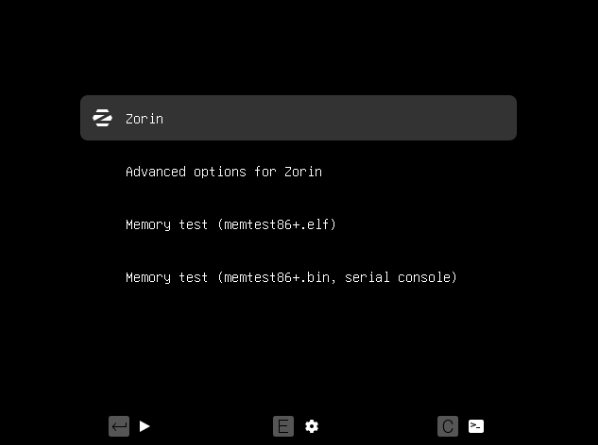

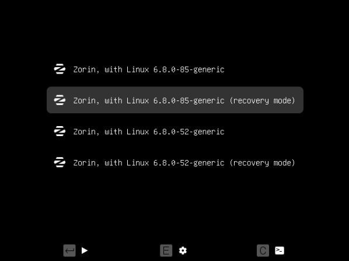

Un cop a dins del menú elegirem la opcio de root.

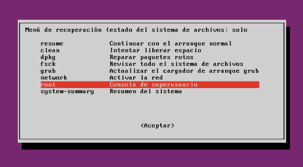

Quan ja poguem modificar, primer haurem d'aplicar la següent comanda per la següent rao:
Ja tenim obert un terminal i en mode root, però si intentem canviar la contrasenya d'un usuari (passwd nom_usuari), veurem que al final del procés ens apareix el missatge d'error següent: «Authenticacion token manipulation
error passwd: password unchanged». Això és degut a que el sistema de fitxers està muntat en mode lectura. Per tant, abans de procedir al canvi, hem de muntar aquest sistema en mode lectura/escriptura:

Ara si podrem modificar la contrasenya, pero per saber el nom que hem d’utilitzar per fer la comanda passwd usuari, apliquem aquesta comanda per saber-ho.

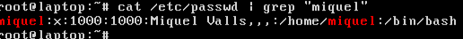

Ens diu que l’usuari “miquel” pertany al nom d’usuari “Miquel Valls”.
Ara sí podem canviar la contrasenya.

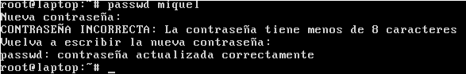

El primer pas serà executar l'ordre grub-mkpasswd-pbkdf2. Aquesta ordre serveix per generar un hash a partir d'una contrasenya, utilitzant la funció criptogràfica PBKDF2.

El problema és que necessitarem afegir aquest hash a un fitxer i escriure'l no és una opció còmoda ni senzilla. Farem servir la comanda tee que ens permetrà redirigir la sortida estàndard cap a un arxiu. Per tant, 
escriurem el següent:

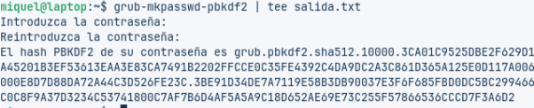

El pas següent serà editar el fitxer /etc/grub.d/40_conf per afegir l'autenticació. Serà en aquest fitxer on necessitarem afegir el hash calculat anteriorment. Per això, obrirem l'editor nano però habilitant l'opció 
multibuffer que permet copiar text d'un fitxer a un altre.

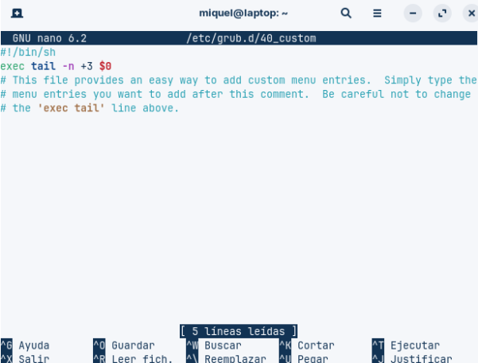

Un cop obert l'editor, fem CTRL+r i ens apareixerà un diàleg per introduir el fitxer origen, aquí posarem el fitxer creat anteriorment sortida.txt.

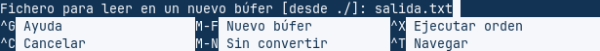

El següent pas és copiar el bloc del text corresponent al hash, per això, ens situem a l'inici de la línia en qüestió i premem simultàniament ALT+a. Marxem al final de la línia (amb el cursor o amb CTRL-e), amb això hem 
seleccionat el text que volem copiar. Amb ALT+6 copiem el text al buffer i podem tancar el fitxer amb CTRL+x.

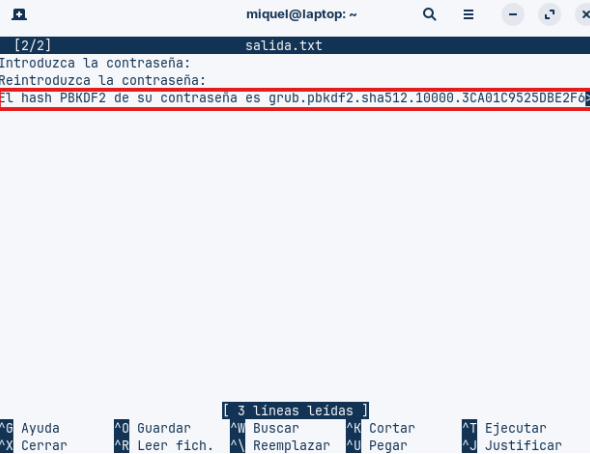

De nou estem al fitxer /etc/grub.d/40_custom i afegirem aquestes dues línies al final del fitxer. On nom_login serà l'identificador d'usuari per autenticar-se al GRUB.

A la segona línia, a continuació del nom usat per al login, enganxarem el contingut del buffer, que correspon al hash. Per això, simplement farem CTRL+u i una vegada fet això, només resta guardar i sortir de nano.

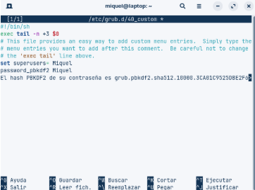

Ara nomes guardem els canvis a la configuració del GRUB.

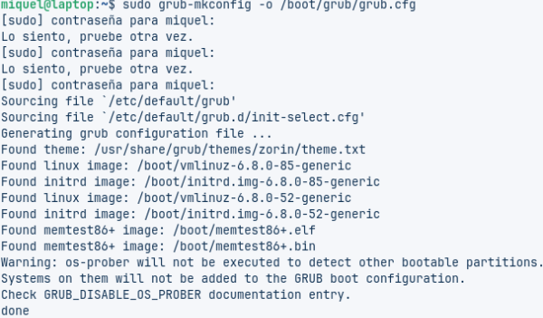

Per últim reiniciem la màquina i veiem si ens demana el nom d’usuari i la contrasenya.

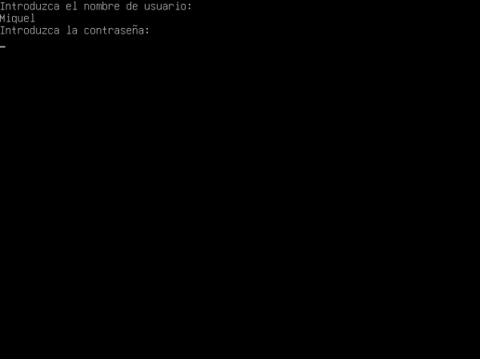

Enllaç al drive: https://drive.google.com/drive/u/0/folders/1gxAv-g1949wPHjVZ0O2bhYzN_9W0S1a_
