# web_proves_polhernandez

Un cop hem entrar al WP per administrador, començarem a fer la feina necessaria.
El prime pas que haurem de fer es crear unes pàgines, per això tenim que mirar a les seccions de l'esquerra, donar a páginas i després a agregar página.

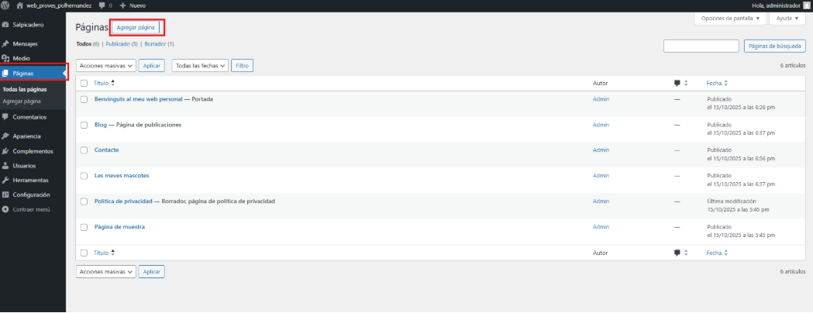

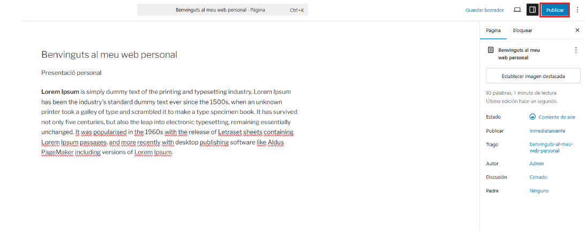

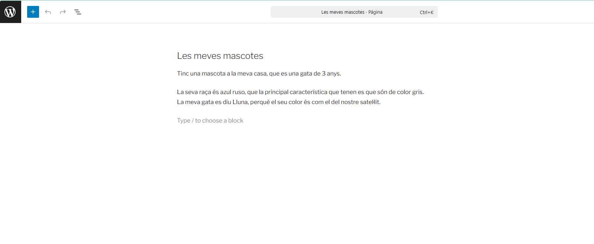

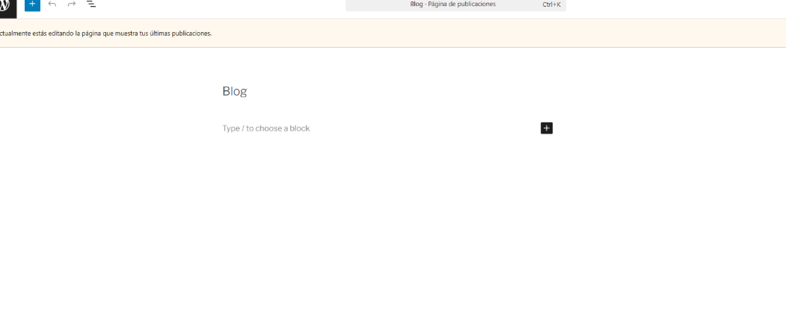

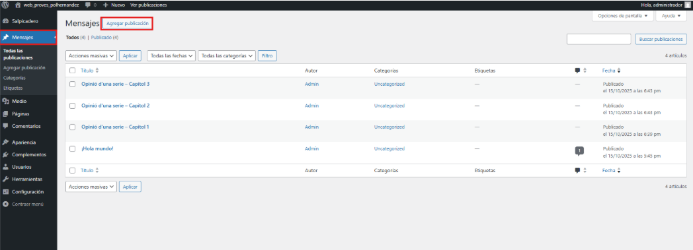

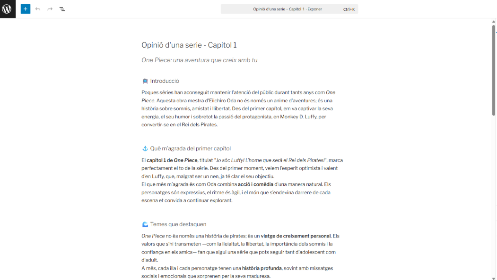

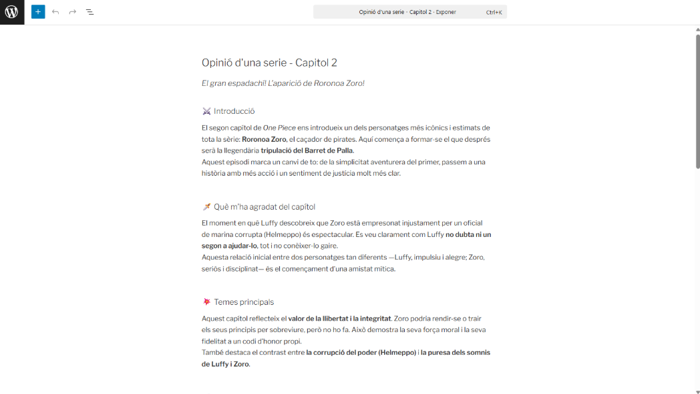

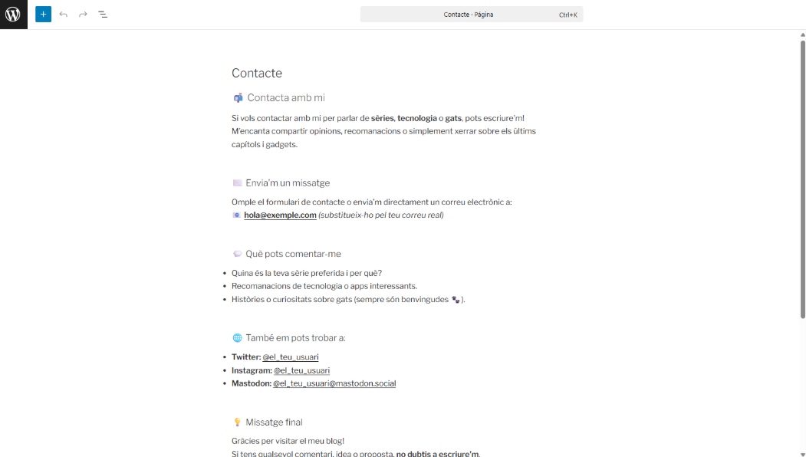

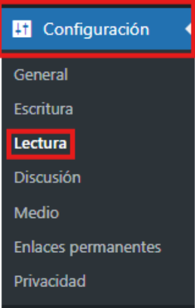

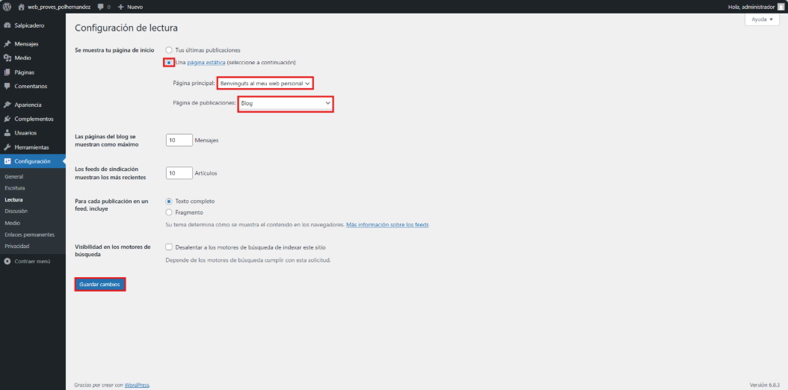

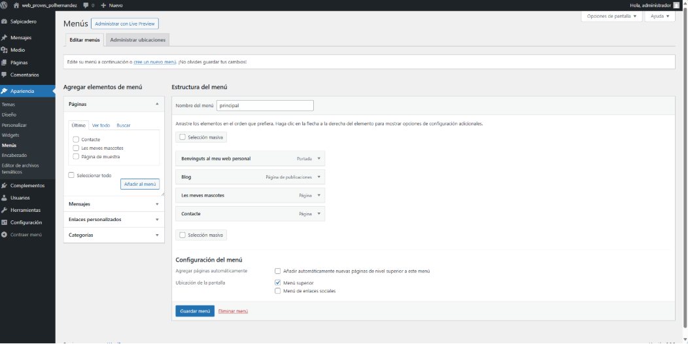

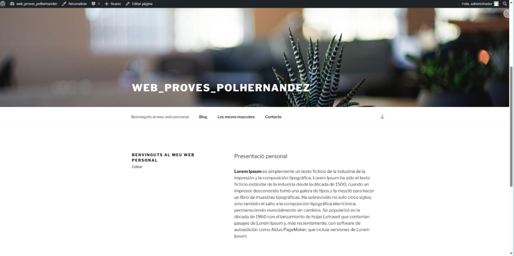

